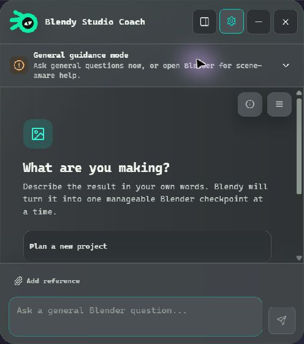
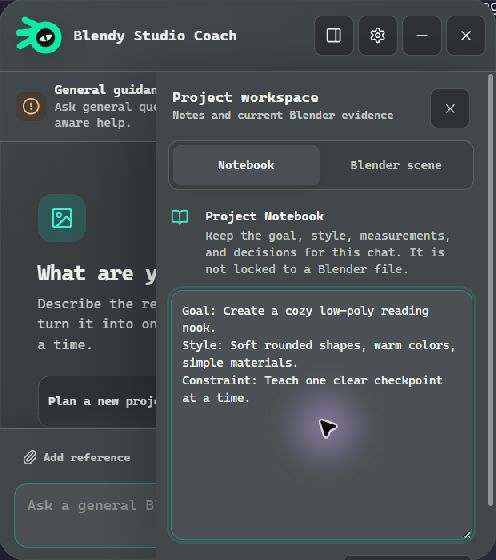
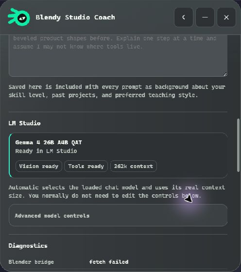

# Blendy Local AI Tutor

Blendy is a local Blender tutor that connects Blender to an LM Studio model
running on your own computer. It is tutor-only: it gives guidance, reads scene
context, and does not execute model-written Blender Python.

## Download

[](https://github.com/djenta/blendy/releases/latest)

<p>
  <a href="docs/screenshots/blendy-promo-1.png"></a>
</p>
<p>
  <a href="docs/screenshots/blendy-promo-2.png"></a>
</p>
<p>
  <a href="docs/screenshots/blendy-promo-3.png"></a>
</p>

Download the Windows installer from the latest GitHub Release:

```text
Blendy Local AI Tutor Setup 2.0.0.exe
```

The 2.0 installer is not code-signed, so Windows SmartScreen may show an
unknown-publisher warning. The release includes `SHA256SUMS.txt` so you can
verify that the installer matches the file built by GitHub Actions.

## What You Need

- Windows
- Blender 4.x or newer
- LM Studio with the local server turned on
- A chat model loaded in LM Studio

Gemma 4 is the recommended model family for the full experience because it can
understand screenshots, reason about visual references, and use Blendy's local
reference tools. Blendy checks the loaded model and falls back to the features
that model can actually use.

Default LM Studio server URL:

```text
http://localhost:1234/v1
```

## Install On Windows

1. Download `Blendy Local AI Tutor Setup 2.0.0.exe`.
2. Run the installer.
3. Open Blender.
4. In the 3D View, press `N` to open the right sidebar.
5. Click the `Local AI` tab.
6. Click `Launch Blendy`.
7. In LM Studio, load a model and start the local server.
8. In Blendy, wait for the three readiness checks and send a question.

The installer also creates a desktop shortcut and Start Menu shortcut for
Blendy. It installs to the normal per-user Windows app location so Blender can
find it from the `Launch Blendy` button.

## Where The Blender Add-on Appears

After install, open Blender and press `N` in the 3D View.

Look for:

```text
N-panel > Local AI > Launch Blendy
```

The add-on starts a small local bridge so the desktop Blendy app can read the
current Blender scene.

## If The Local AI Tab Is Missing

The installer tries to copy and enable the add-on for the Blender versions it
can find. If the tab is missing, open Blender:

1. Go to `Edit > Preferences > Add-ons`.
2. Search for `Local AI Chat`.
3. Enable it.
4. Return to the 3D View, press `N`, and open the `Local AI` tab.

If Blender was installed after Blendy, run the Blendy installer again so it can
copy the add-on into that Blender version.

If the add-on still does not appear, install the fallback add-on zip manually:

1. In Blender, go to `Edit > Preferences > Add-ons`.
2. Click `Install...`.
3. Pick `local_ai_chat.zip` from the Blendy release download.
4. Enable `Local AI Chat`.
5. Return to the 3D View, press `N`, and open the `Local AI` tab.

Installer add-on logs are written to:

```text
%APPDATA%\Blendy\installer-addons.log
```

## Using Blendy

- Start by describing what you are making and what kind of help you want.
- Follow the current checkpoint, then use `Check my work` so Blendy inspects a
  fresh scene and tells you whether the expected change is visible.
- Use `I'm stuck` for a smaller recovery step or `Show me where` for the exact
  Blender area and control.
- Attach up to two reference images when the visual target matters.
- Keep goals, decisions, and recurring constraints in the Project Notebook.
  The notebook belongs to the chat and does not lock that chat to one `.blend`.
- If Blender changes to a different saved scene, Blendy warns you before old
  project context can be mixed in. You can keep the chat or start a fresh one.
- Choose `Local only`, `Ask me`, or `Automatic` for external web access. Local
  Blender references remain available when the web is off.

## Troubleshooting

If Blendy says the Blender bridge is disconnected:

1. Open Blender.
2. Press `N`.
3. Open `Local AI`.
4. Click `Launch Blendy`.

If Blendy cannot reach the model:

1. Open LM Studio.
2. Load a model.
3. Start the local server.
4. Confirm the server URL is `http://localhost:1234/v1`.

Blendy's readiness card reports the selected model, whether it can inspect
images and use tools, and the context size of the loaded instance. Advanced
model controls remain available in Settings, but normal use should not require
editing a model ID or token count by hand.

## Privacy

Blendy is designed for local use. Your model runs through LM Studio on your
computer.

External web access is off in `Local only`, requires approval in `Ask me`, and
may send a model-written search query in `Automatic`. Web pages are treated as
untrusted evidence and are read through size, timeout, redirect, content-type,
and private-network limits.

Stored locally on your computer:

- app settings
- chats
- diagnostics
- prompt packets sent to LM Studio
- Blender scene facts
- the current `.blend` path when Blender reports one, used only for the optional
  scene-mismatch warning
- bridge discovery data

## Developer Build

From the `blendy` folder:

```powershell
npm install
npm test
npm run build
npm run dist
```

GitHub Actions runs the same checks on every pull request and main-branch push.
Pushing a version tag builds and publishes the Windows installer and manual
Blender add-on package.
